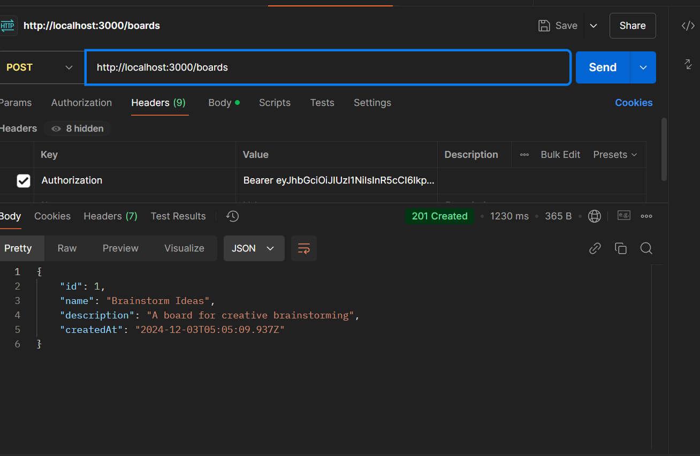

# BrainstormHub API Documentation

## Endpoints

### 1. **Login**
   - **URL:** `POST /auth/login`
   - **Request Body:**
     ```json
     {
       "email": "user@example.com",
       "password": "yourpassword"
     }
     ```
   - **Response:**
     ```json
     {
       "accessToken": "your_jwt_token"
     }
     ```

   ### Screenshot:
   

---

### 2. **Create Board**
   - **URL:** `POST /boards`
   - **Request Body:**
     ```json
     {
       "name": "Brainstorm Ideas",
       "description": "A board for creative brainstorming"
     }
     ```
   - **Response:**
     ```json
     {
       "id": 1,
       "name": "Brainstorm Ideas",
       "description": "A board for creative brainstorming",
       "createdAt": "2024-12-03T05:05:09.937Z"
     }
     ```

   ### Screenshot:
   

---

### 3. **Get Board**
   - **URL:** `GET /boards`
   - **Response:**
     ```json
     [
       {
         "id": 1,
         "name": "Brainstorm Ideas",
         "description": "A board for creative brainstorming",
         "createdAt": "2024-12-03T05:05:09.937Z"
       }
     ]
     ```

   ### Screenshot:
   

---

### 4. **Get Board by ID**
   - **URL:** `GET /boards/{id}`
   - **Example Request:** `GET /boards/1`
   - **Response:**
     ```json
     {
       "id": 1,
       "name": "Brainstorm Ideas",
       "description": "A board for creative brainstorming",
       "createdAt": "2024-12-03T05:05:09.937Z"
     }
     ```

   ### Screenshot:
   

---

### 5. **Update Board**
   - **URL:** `PATCH /boards/{id}`
   - **Request Body:**
     ```json
     {
       "name": "Updated Board1 Name",
       "description": "Updated description"
     }
     ```
   - **Response:**
     ```json
     {
       "id": 1,
       "name": "Updated Board1 Name",
       "description": "Updated description",
       "createdAt": "2024-12-03T05:05:09.937Z"
     }
     ```

   ### Screenshot:
   

---

### 6. **Delete Board**
   - **URL:** `DELETE /boards/{id}`
   - **Example Request:** `DELETE /boards/1`
   - **Response:** `204 No Content`

   ### Screenshot:
   

---
